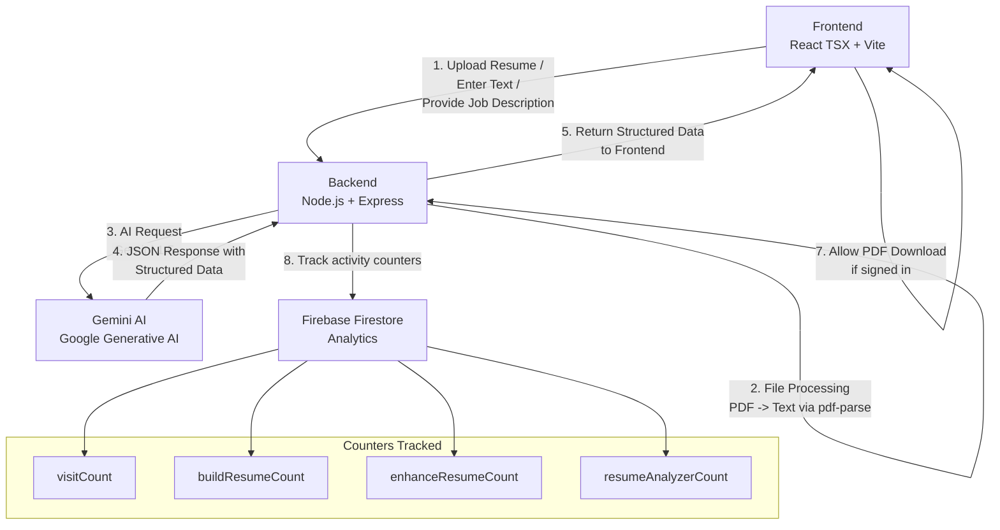

# Resume AI Analyzer & Builder

## Project Summary

A full-stack web application that helps users analyze resumes against job descriptions, generate ATS scores, get improvement suggestions, and build/enhance resumes using AI technology.

## Tech Stack

- **Frontend**: React TypeScript + Vite, Tailwind CSS, shadcn-ui
- **Backend**: Node.js + Express.js
- **AI Engine**: Google Gemini 1.5 API
- **Database**: Firebase Firestore
- **Authentication**: Firebase Auth
- **File Processing**: multer + pdf-parse

## Features

- 📊 ATS Resume Scoring with Job Description Matching
- 🤖 AI-Powered Resume Enhancement
- 🛠️ Interactive Resume Builder
- 📄 Manual resume builder with PDF export
- 📈 Analytics and usage tracking
- 🔐 User Authentication System

## Local Development Setup

**Use your preferred IDE:**

If you want to work locally using your own IDE, you can clone this repo and push changes. The only requirement is having Node.js & npm installed.

Follow these steps:

```sh
# Step 1: Clone the repository using the project's Git URL.
git clone <YOUR_GIT_URL>

# Step 2: Navigate to the project directory.
cd <YOUR_PROJECT_NAME>

# Step 3: Install the necessary dependencies.
npm install

# Step 4: Install frontend dependencies
cd frontend
npm install
cd ..

# Step 5: setup .env fie

# Step 6: Install backend dependencies
cd backend
npm install
cd ..

# Step 7: Start Backend Server.
cd backend
node server.js
cd ..

# Step 8: Start the development server with auto-reloading and an instant preview.
cd frontend
npm run dev
```
Access Points:
- Frontend Application: http://localhost:8080
- Backend API Server: http://localhost:5000

**Environment Configuration**
env
```sh
PORT=5000
NEXT_PUBLIC_GEMINI_API_KEY=your_actual_gemini_api_key
FIREBASE_PROJECT_ID=your_firebase_project_id
FIREBASE_CLIENT_EMAIL=your_firebase_client_email
FIREBASE_PRIVATE_KEY=your_firebase_private_key
NEXT_PUBLIC_FIREBASE_API_KEY=your_firebase_api_key
NEXT_PUBLIC_FIREBASE_AUTH_DOMAIN=your_project.firebaseapp.com
NEXT_PUBLIC_FIREBASE_PROJECT_ID=your_firebase_project_id
NEXT_PUBLIC_FIREBASE_STORAGE_BUCKET=your_project.appspot.com
NEXT_PUBLIC_FIREBASE_MESSAGING_SENDER_ID=your_sender_id
NEXT_PUBLIC_FIREBASE_APP_ID=your_firebase_app_id
```

## API Endpoints Overview

| Endpoint | Method | Purpose |
|----------|--------|---------|
| `/api/analyze` | POST | Resume analysis vs JD |
| `/api/enhance` | POST | AI resume enhancement |
| `/api/stats` | GET | Fetch global counters |
| `/api/stats/increment/visit` | POST | Increment visit count |
| `/api/stats/increment/build` | POST | Increment build resume count |
| `/api/stats/increment/enhance` | POST | Increment enhanced resume count |
| `/api/stats/increment/analyze` | POST | Increment resume analysis count |

## Usage Guide
- Resume Analysis: Upload a resume PDF or paste text to get an ATS score and improvement suggestions
- Resume Enhancement: Sign in to use AI for optimizing your resume content
- Resume Builder: Create a new resume from scratch with guided sections
- Export: Download your finished resume as a professional PDF document

## System Architecture / Workflow




## Author
- Ashish Sah - Full Stack Developer

## Support
** For technical support or questions, please contact:
- Email: ashishsah51@gmail.com
- linkdean url: https://www.linkedin.com/in/ashish-sah-444bb81b5/